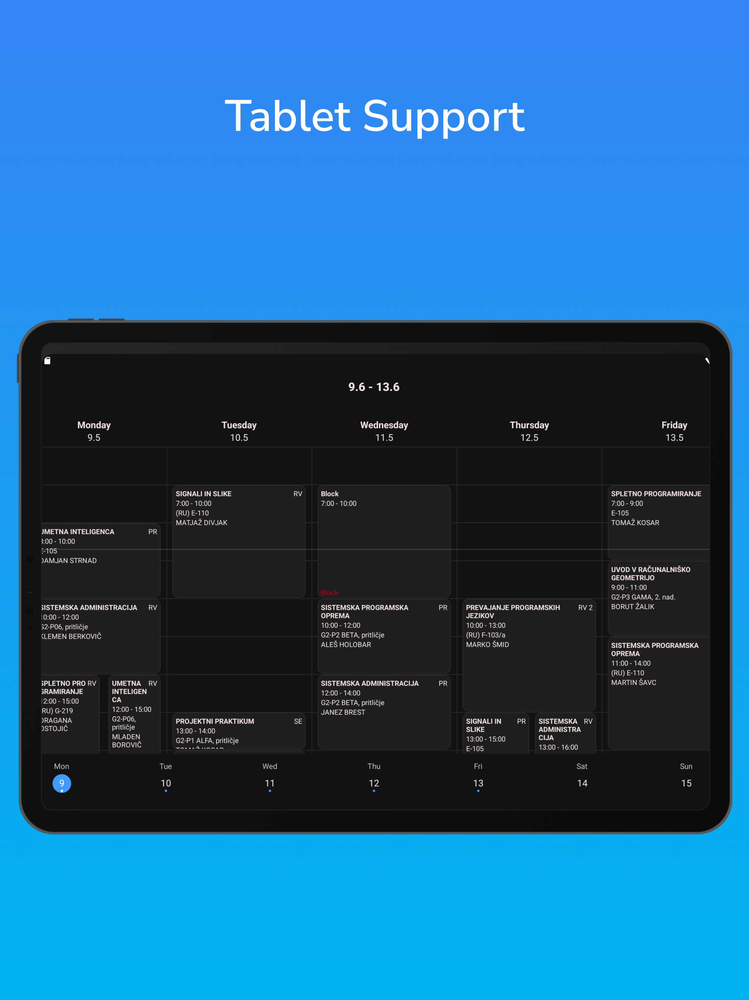

# Open Wise TimeTable


This is a mobile app made with react native and expo, to view data from Wise TimeTable. It supports all Wise faculties which provide a school code. Android users can install the app from app store. Due to Apple app store requirements, I am currently unable to publish it to ios app store. [There is a web version available with similar features available here.](https://mrdog210.github.io/Open-WTimeTable-Web/)

[](https://play.google.com/store/apps/details?id=com.mrdog210.OpenWTimeTable2)

|                               |                               |                               |                               |                               |                               |
|-------------------------------|-------------------------------|-------------------------------|-------------------------------|-------------------------------|-------------------------------|
|  |  |  |  |  |  |
## Features:
Main advantage of this app over the official one is, that you can pick a separate group for each course.
- Separate selectable groups for each course
- Select lectures from multiple years and groups
- Add and edit custom lectures
- Dynamic dark/light mode
- Tablet support
- Add custom notes to lectures
- Widget support on android
- Supports every Wise TimeTable faculty with a provided school code

## Setup instructions

1. Clone the repo
2. run  ``` npm install ```
3. Duplicate ```example.env``` and rename it to ```.env``` in the root folder and enter your credentials
4. Build a dev client and install it on your device ```eas build --profile development --platform android --local```
5. ``` npx expo start ```

