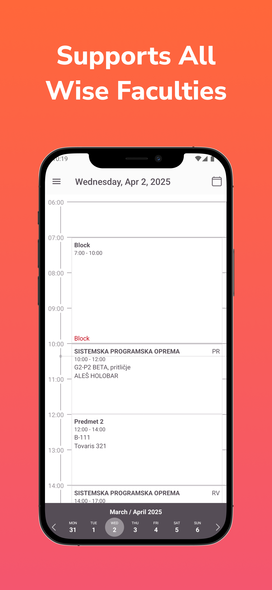
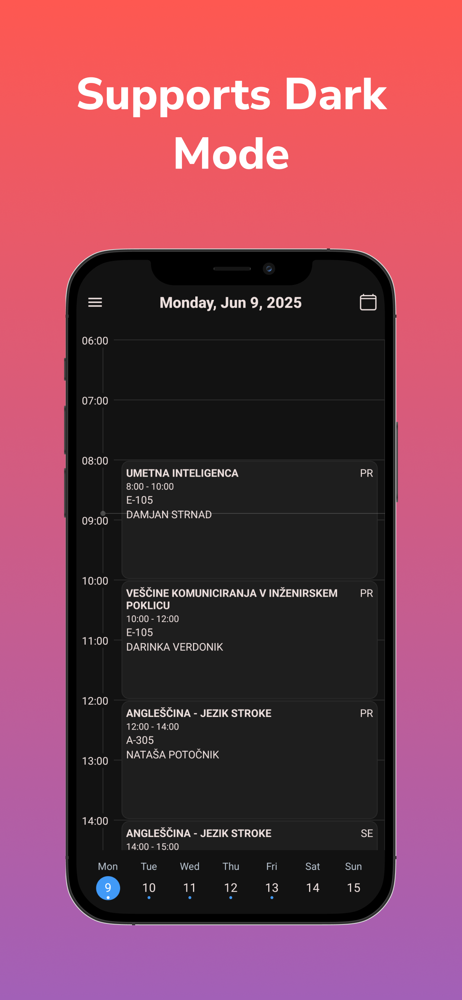
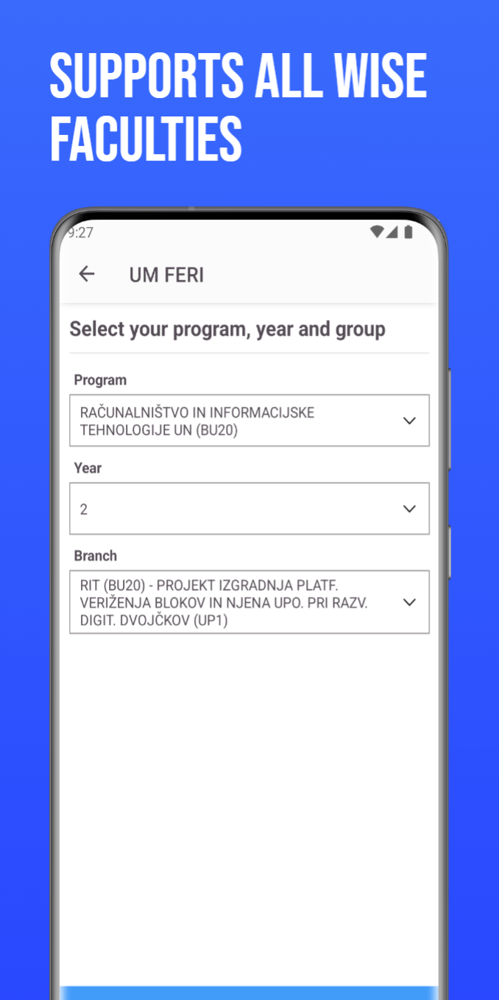

# Open Wise TimeTable


[](https://www.gnu.org/licenses/gpl-3.0)  

This is a mobile app made with react native and expo, to view the timetable.

|                               |                               |                               |                               |                               |
|-------------------------------|-------------------------------|-------------------------------|-------------------------------|-------------------------------|
|  |  |  |  |  |
## Features:
Main advantage of this app over the official one is, that you can pick a separate group for each course.
- Dark/light mode
- Separate selectable groups for each course
- Tablet support
- Add custom notes to lectures

## Setup instructions

1. Clone the repo
2. run  ``` yarn install ```
3. Rename loginCredentials to loginCredentials.js in constants folder and enter your credentials
4. ``` npx expo start ```

## Packages Used:

[Expo](https://docs.expo.dev)  
[React navigator](https://reactnavigation.org)  
[React native calander timetable](https://github.com/dorkyboi/react-native-calendar-timetable)  
[React native calander strip](https://github.com/BugiDev/react-native-calendar-strip)  
[Expo sqlite-next](https://docs.expo.dev/versions/v50.0.0/sdk/sqlite-next/)  
[React native dropdown picker](https://github.com/hossein-zare/react-native-dropdown-picker)  
[React native loading spinner overlay](https://github.com/ladjs/react-native-loading-spinner-overlay)  
[Ky](https://github.com/sindresorhus/ky)  
[React native async storage](https://react-native-async-storage.github.io/async-storage/)  
[Datetimepicker](https://github.com/react-native-datetimepicker/datetimepicker)  
[react-native-netinfo](https://github.com/react-native-netinfo/react-native-netinfo)  
[react-native-dialog](https://github.com/mmazzarolo/react-native-dialog)  
