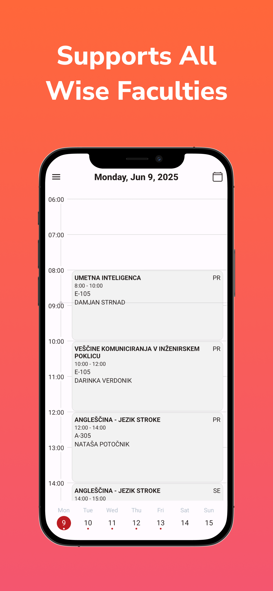

# Open Wise TimeTable


This is a mobile app made with react native and expo, to view data from Wise TimeTable. It supports all Wise faculties which provide a school code.

|                               |                               |                               |                               |                               |
|-------------------------------|-------------------------------|-------------------------------|-------------------------------|-------------------------------|
|  |  |  |  |  |
## Features:
Main advantage of this app over the official one is, that you can pick a separate group for each course.
- Separate selectable groups for each course
- Dynamic dark/light mode
- Add and edit custom lectures
- Tablet support
- Add custom notes to lectures

## Setup instructions

1. Clone the repo
2. run  ``` npm install ```
3. Duplicate ```example.env``` and rename it to ```.env``` in the root folder and enter your credentials
4. ``` npx expo start ```

